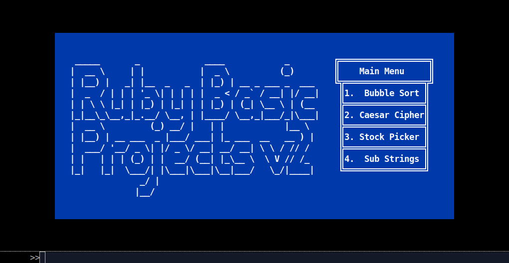
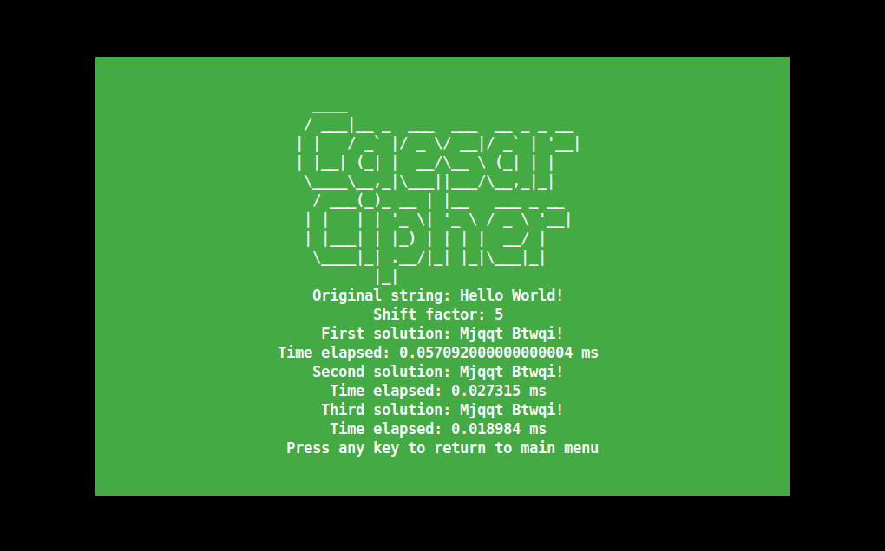
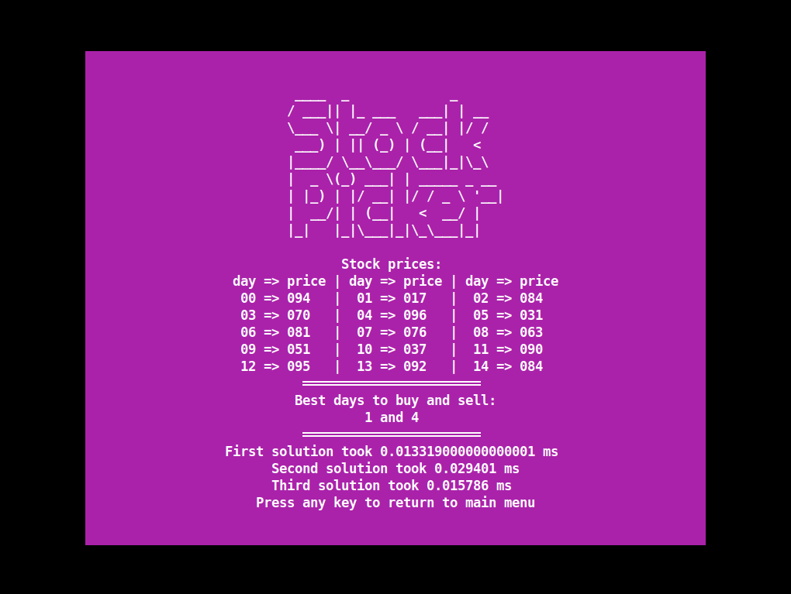
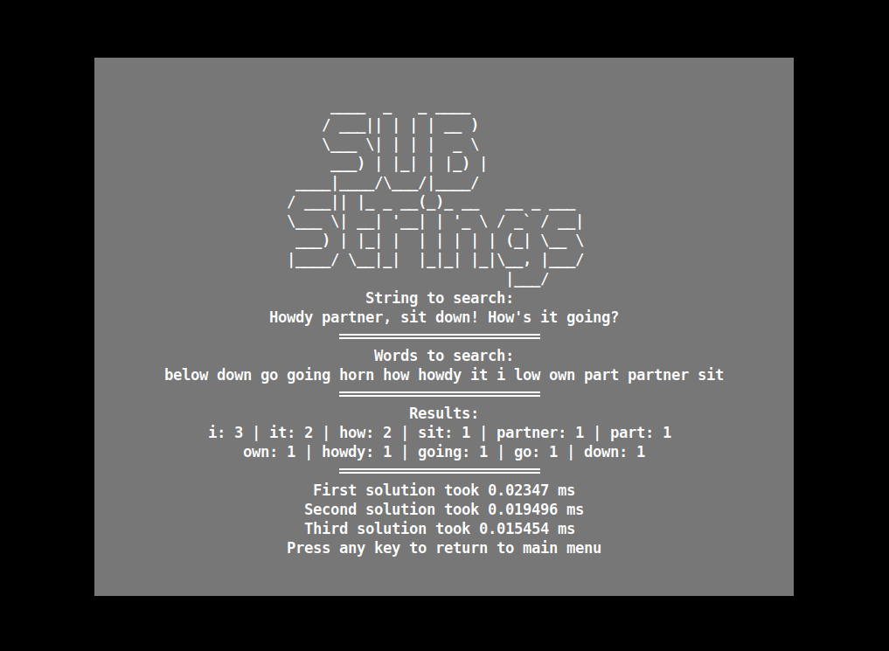
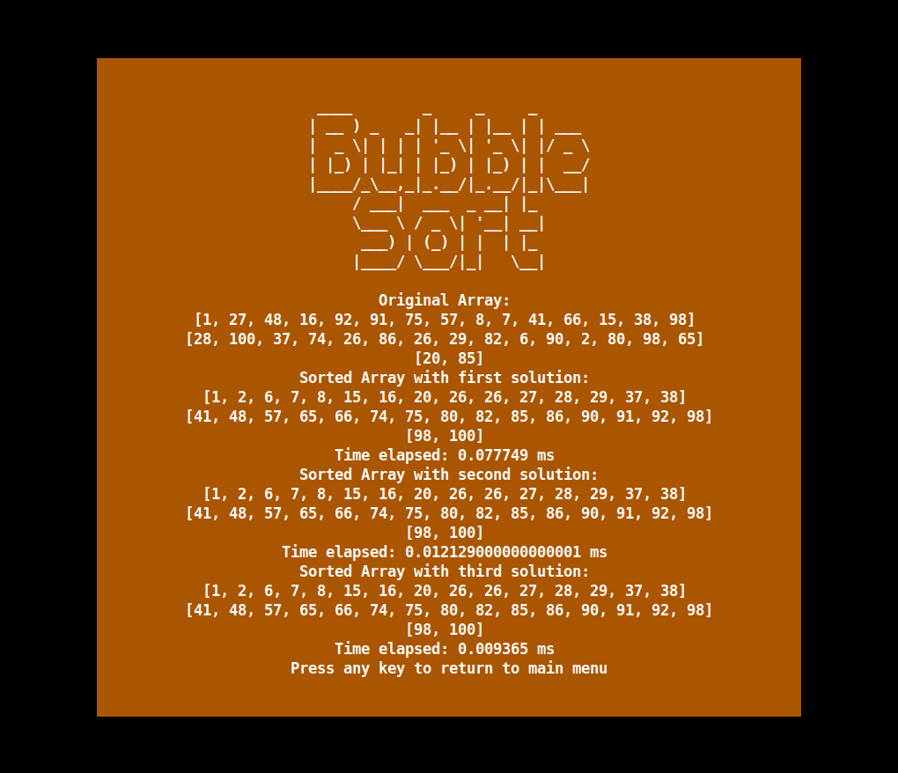

# Ruby Basic Projects (TOP)

4 basic projects made for The Odin Project, each with a submenu for input the variables to work with
Each has been tested with Rspec and also comes with linters best practices



### 1. Caesar Cipher



#### What does it do?

This program is a simple caesar cipher, it takes a string and a number as input and outputs a string with the letters shifted by the number given.

### 2. Stock Picker



#### What does it do?

This program takes an array of stock prices, one for each hypothetical day. It returns a pair of days representing the best day to buy and the best day to sell. Days start at 0.

### 3. Substrings



#### What does it do?

This program takes a string as the first argument and then an array of valid substrings (your dictionary) as the second argument. It should return a hash listing each substring (case insensitive) that was found in the original string and how many times it was found.

### 4. Bubble Sort



#### What does it do?

This program takes an array of numbers as input and outputs the array sorted using the bubble sort algorithm

## Built With

- Ruby v 3.1.2p20

## Getting Started

To get a local copy up and running follow these simple example steps.

### Prerequisites

- Ruby v 3.1.2p20
- Rspec v 3.10.0 (only for tests)

### Setup

- Make sure you have Ruby installed on your machine
- Clone this repository with
```bash
git clone git@github.com:LuisHernandezCoding/ruby_basic_projects_top.git
```
### How to run it?

2. Open the folder in your terminal
3. Run the command `ruby bin/main.rb` to run the program
4. Follow the instructions in the menu to select the project you want to run

#### How to run the tests?

1. Open the folder in your terminal
2. Run the command `rspec` to run the tests (you should have installed Rspec)

## Getting Started

To get a local copy up and running follow these simple example steps.

## Author

👤 **Luis Hernandez**

- GitHub: [@LuisHernandezCoding]

## Credits

- Project made mainly for 
| [The Odin Project](https://www.theodinproject.com) | 
[(Full stack ruby on rails)](https://www.theodinproject.com/paths/full-stack-ruby-on-rails/courses/ruby) | 
[Basic ruby projects](https://www.theodinproject.com/paths/full-stack-ruby-on-rails/courses/ruby#basic-ruby-projects) | 
[ruby connect four](https://www.theodinproject.com/lessons/ruby-connect-four) |